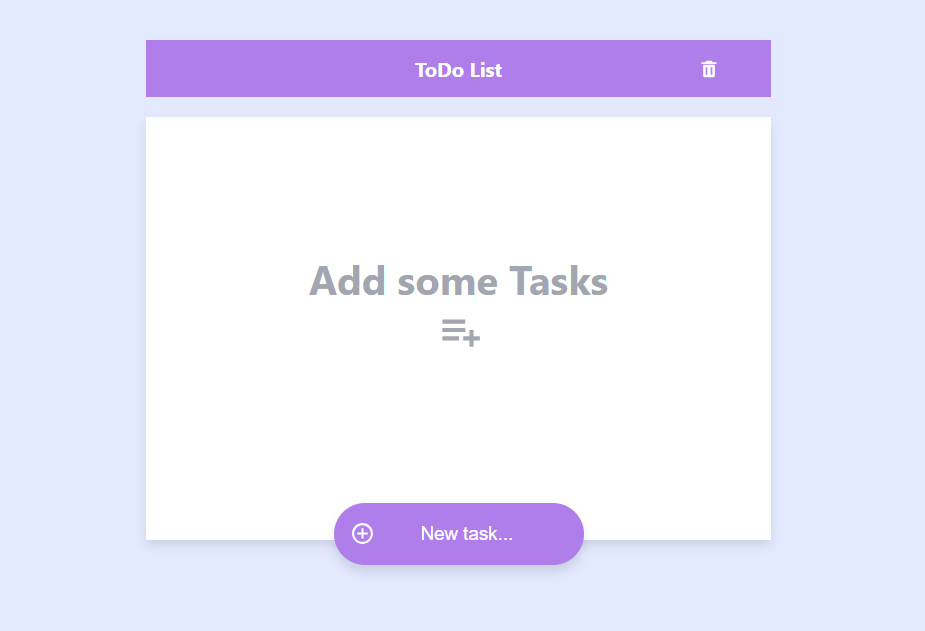

# Todo List App



This project is a simple React application for managing a todo list. It allows users to add tasks, mark them as completed, and delete tasks as needed.

## Features

- **Add Task**: Users can add new tasks to the list.
- **Complete Task**: Tasks can be marked as completed.
- **Delete Task**: Users can remove tasks from the list.

## Project Structure

The project is structured as follows:

```
todo-list/
├── node_modules/
├── public/
│   ├── favicon.ico
│   ├── index.html
│   ├── logo192.png
│   ├── logo512.png
│   ├── manifest.json
│   └── robots.txt
├── src/
│   ├── components/
│   │   ├── ListComponent.js
│   │   └── TaskComponent.js
│   ├── App.css
│   ├── App.js
│   ├── index.js
│   └── variables.css
├── .gitignore
├── package-lock.json
└── package.json
```

## Installation

To run this project locally, follow these steps:

1. Clone the repository:
   ```bash
   git clone https://github.com/ro77en/react-todo-list.git
   ```
2. Navigate into the project directory:
   ```bash
   cd todo-list
   ```
3. Install dependencies:
   ```bash
   npm install
   ```
4. Start the development server:
   ```bash
   npm start
   ```
5. Open [http://localhost:3000](http://localhost:3000) to view it in the browser.

## Dependencies

- `react` - JavaScript library for building user interfaces.
- `react-dom` - React package for working with the DOM.
- `react-icons` - Icon library for React.
- `react-scripts` - Scripts and configurations used by Create React App.
- `@testing-library/jest-dom`, `@testing-library/react`, `@testing-library/user-event` - Testing utilities for React components.
- `web-vitals` - Tools for measuring web performance.

## Scripts

In the project directory, you can run:

- `npm start`: Runs the app in the development mode.
- `npm run build`: Builds the app for production to the `build` folder.
- `npm run eject`: **Note: this is a one-way operation**. It allows you to eject the project configuration and dependencies into the `src` and `config` directories.

## Supported Browsers

The app supports the following browsers:

- Production: >0.2%, not dead, not op_mini all
- Development: last 1 Chrome version, last 1 Firefox version, last 1 Safari version

## License

This project is licensed under the MIT License - see the LICENSE file for details.

---

Feel free to customize and expand upon this README to better fit your project's specific details and requirements.